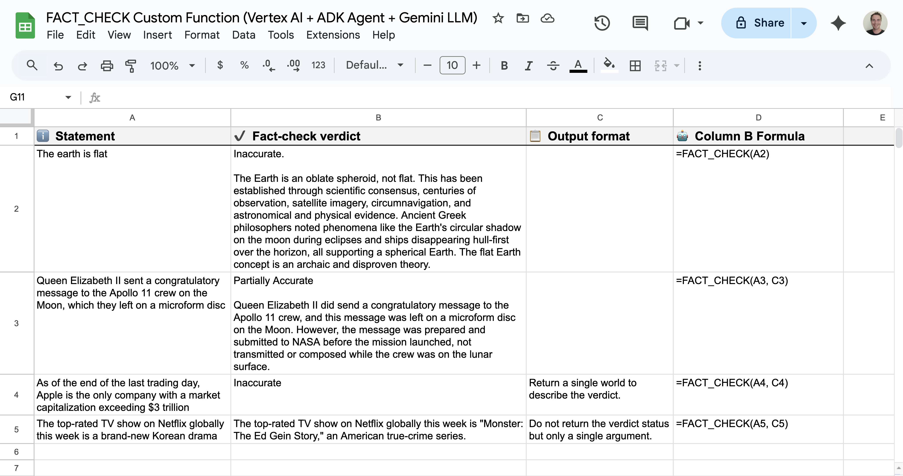

# Google Sheets Custom Function relying on ADK AI Agent and Gemini model

A [Vertex AI](https://cloud.google.com/vertex-ai) agent-powered **fact checker** custom function for Google Sheets to be used as a bound Apps Script project.

## Overview

The **Google Sheets custom function** named `FACT_CHECK` integrates the sophisticated, multi-tool, multi-step reasoning capabilities of a **Vertex AI Agent Engine (ADK Agent)** directly into your Google Sheets spreadsheets.

It operates as an end-to-end solution. It analyzes a statement, grounds its response using the latest web information, and returns the result in the format you need:

  * Usage: `=FACT_CHECK("Your statement here")` for a concise and summarized output. `=FACT_CHECK("Your statement here", "Your output formatting instructions here")` for a specific output format.
  * Reasoning: [**LLM Auditor ADK AI Agent (Python sample)**](https://github.com/google/adk-samples/tree/main/python/agents/llm-auditor).
  * Output formatting: [**Gemini model**](https://cloud.google.com/vertex-ai/generative-ai/docs/models).

## Prerequisites

* Google Cloud Project with billing enabled.

## Set up your environment

1. Configure the Google Cloud project
   1. Enable the Vertex AI API
   1. Create a Service Account and grant the role `Vertex AI User`
   1. Create a private key with type JSON. This will download the JSON file.
1. Setup, install, and deploy the LLM Auditor ADK AI Agent sample
   1. Use Vertex AI
   1. Use the same Google Cloud project
   1. Use the location `us-central1`
   1. Use the Vertex AI Agent Engine
1. Open an Apps Script project bound to a Google Sheets spreadsheet
   1. Add a Script Property. Enter `LOCATION` as the property name and `us-central1` as the value. 
   1. Add a Script Property. Enter `GEMINI_MODEL_ID` as the property name and `gemini-2.5-flash-lite` as the value. 
   1. Add a Script Property. Enter `REASONING_ENGINE_ID` as the property name and the ID of the deployed LLM Auditor ADK AI Agent as the value. 
   1. Add a Script Property. Enter `SERVICE_ACCOUNT_KEY` as the property name and paste the JSON key from the service account as the value. 
   1. Add OAuth2 v43 Apps Script Library using the ID `1B7FSrk5Zi6L1rSxxTDgDEUsPzlukDsi4KGuTMorsTQHhGBzBkMun4iDF`
   1. Set the script files `Code.gs` and `AiVertex.gs` in the Apps Script project with the JS file contents in this project
